<!--ts-->
   * [第一章：计算机网络和因特网](#第一章计算机网络和因特网)
      * [1.1 什么是因特网](#11-什么是因特网)
         * [1.1.1 具体构成描述](#111-具体构成描述)
      * [1.2 网络边缘](#12-网络边缘)
         * [1.2.1 接入网](#121-接入网)
            * [1.家庭接入](#1家庭接入)
            * [2. 企业（和家庭）接入：以太网和WIFI](#2-企业和家庭接入以太网和wifi)
            * [3. 广域无线接入：3g和LTE](#3-广域无线接入3g和lte)
         * [1.2.2 物理媒体](#122-物理媒体)
      * [1.3 网络核心](#13-网络核心)
         * [1.3.1 分组交换](#131-分组交换)
            * [1. 存储转发传输](#1-存储转发传输)
            * [2. 排队时延和分组丢失](#2-排队时延和分组丢失)
            * [3. 转发表和路由选择协议](#3-转发表和路由选择协议)
         * [1.3.2 电路交换](#132-电路交换)
            * [1. 电路交换网络中的复用](#1-电路交换网络中的复用)
            * [2. 分组交换与电路交换的对比](#2-分组交换与电路交换的对比)
         * [1.3.3 网络的网络](#133-网络的网络)
            * [1. 网络结构 1](#1-网络结构-1)
            * [2. 网络结构 2](#2-网络结构-2)
            * [3. 网络结构 3](#3-网络结构-3)
      * [1.4 分组交换网络中的时延、丢包和吞吐量](#14-分组交换网络中的时延丢包和吞吐量)
         * [1.4.1 分组交换网中的时延概述](#141-分组交换网中的时延概述)
            * [1.处理时延](#1处理时延)
            * [2. 排队时延](#2-排队时延)
            * [3. 传输（发射）时延](#3-传输发射时延)
            * [4.传播时延](#4传播时延)
            * [5.传输时延和传播时延比较](#5传输时延和传播时延比较)
         * [1.4.2 排队时延和丢包](#142-排队时延和丢包)
         * [1.4.3 端到端时延](#143-端到端时延)
         * [1.4.4 计算机网络中的吞吐量](#144-计算机网络中的吞吐量)
      * [1.5 协议层次及其服务模型](#15-协议层次及其服务模型)
         * [1.5.1 分层的体系结构](#151-分层的体系结构)
            * [1. 协议分层](#1-协议分层)
            * [OSI模型](#osi模型)
         * [1.5.2 封装](#152-封装)
         * [1.6 面向攻击的网络](#16-面向攻击的网络)
   * [第二章：应用层](#第二章应用层)
      * [2.1 应用层协议原理](#21-应用层协议原理)
         * [2.1.1 网络应用程序体系结构](#211-网络应用程序体系结构)
         * [2.1.2 进程通信](#212-进程通信)
            * [1. 客户和服务器进程](#1-客户和服务器进程)
            * [2. 进程与计算机网络之间的接口](#2-进程与计算机网络之间的接口)
            * [3. 进程寻址](#3-进程寻址)
         * [2.1.3 可供应用程序使用的运输服务](#213-可供应用程序使用的运输服务)
         * [2.1.4 因特网提供的运输服务](#214-因特网提供的运输服务)
            * [1. TCP服务](#1-tcp服务)
            * [2. UDP服务](#2-udp服务)
            * [3. 因特网运输协议所不能提供的服务](#3-因特网运输协议所不能提供的服务)
         * [2.1.5 应用层协议](#215-应用层协议)
      * [2.2 Web和HTTP](#22-web和http)
         * [2.2.1 HTTP概况](#221-http概况)
         * [2.2.2 非持续连接和持续连接](#222-非持续连接和持续连接)
            * [1. 采用非持续连接的HTTP](#1-采用非持续连接的http)
            * [2. 采用持续连接的HTTP](#2-采用持续连接的http)
         * [2.2.3 HTTP报文格式](#223-http报文格式)
            * [1. HTTP请求报文](#1-http请求报文)
            * [2. HTTP响应报文](#2-http响应报文)
         * [2.2.4 用户与服务器的交互：cookie](#224-用户与服务器的交互cookie)
         * [2.2.5 Web缓存](#225-web缓存)
         * [2.2.6 条件GET方法](#226-条件get方法)
      * [2.4 DNS：因特网的目录服务](#24-dns因特网的目录服务)
         * [2.4.1 DNS提供的服务](#241-dns提供的服务)
         * [2.4.2 DNS工作机理概述](#242-dns工作机理概述)
         * [2.4.3 DNS记录和报文](#243-dns记录和报文)

<!-- Added by: jing, at: 2018-09-05T11:17+08:00 -->

<!--te-->

# 第一章：计算机网络和因特网

## 1.1 什么是因特网

### 1.1.1 具体构成描述

* **端系统** 通过 **通信链路** 和 **分组交换机** 连接到一起。
* 链路的 **传输速率** 以比特/秒（bit/s，或bps）度量。
* 当一台端系统向另一端系统发送数据时，发送端系统将数据分段，并为每段加上首部字节。由此形成的信息包称为 **分组**。
* 分组交换机两种最著名的类型是
  1. 路由器
  2. 链路层交换机
* **因特网服务提供商**：Internet Service Provider, ISP
* **传输控制协议**：Transmission Control Protocol,TCP
* **网际协议**：Internet Protocol， IP， 定义了在路由器和端系统之间发送和接收的分组格式

## 1.2 网络边缘

### 1.2.1 接入网

#### 1.家庭接入

* **DSL**：Digital Subscriber Line, 本地电话公司是ISP

  DSL调制解调器与位于电话公司的本地中心局（CO）中的数字用户线接入复用器（DSLAM）交换数据。家庭的DSL调制解调器得到数字数据后将其转换为高频音，以通过电话线传输给本地中心局；模拟信号在DSLAM处转换回数字形式。

  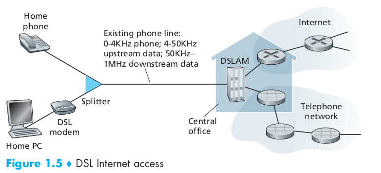

* 电缆：cable Internet access, 有线电视公司是ISP

  电缆因特网接入需要 **电缆调制解调器** (cable modem)，在电缆头端，**电缆调制解调器** （CMTS）与DSLAM具有相似功能，即将下行家庭中的电缆调制解调器发送的模拟信号转换回数字形式。

* 光纤到户：Fiber To The Home, FTTH，从本地中心局直接到每户设置一根光纤，实际一根光纤由许多家庭共享。分配方式有 **主动光纤网络**（Active Optical Network, AON) 和 **被动光纤网络**（Passive Optical Network, PON）。

  PON：每个家庭具有一个 **光纤网络端接器**（Optical Network Terminator, ONT），连接到附近的分配器（splitter），中心局中的 **光纤线路端接器** 提供光信号和电信号之间的转换。

  

#### 2. 企业（和家庭）接入：以太网和WIFI

#### 3. 广域无线接入：3g和LTE

### 1.2.2 物理媒体

* **导引型媒体**（guided media）
  1. 双绞铜线
  2. 同轴电缆
  3. 光纤

* **非导引型媒体**（unguided media）
  1. 陆地无线电信道
  2. 卫星无线电信道

## 1.3 网络核心

### 1.3.1 分组交换

* 源端系统向目的端系统发送报文，会将长报文划分为较小的数据块，称之为 **分组**

* 在源和目的地之间，每个分组都通过 **通信链路** 和 **分组交换机** （主要有两类：**路由器**和**链路层交换机**）传送。
* 分组以等于该链路 **最大** 传输速率的速度在通信链路上传输

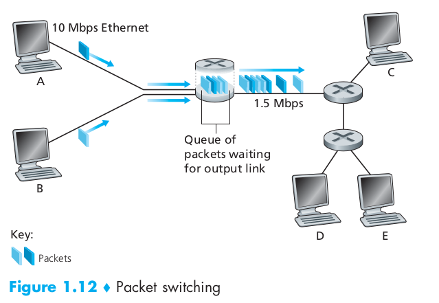

#### 1. 存储转发传输

在交换机能够开始向输出链路传输该分组的第一个比特之前，必须接收到整个分组

#### 2. 排队时延和分组丢失

* 对于每条相连的链路，该分组交换机有一个 **输出缓存**（output buffer，也称为 **输出队列**（output queue））。如果到达的分组传输到某条链路，但是该链路正在传输其他分组，则该分组必须在输出缓存中等待。因此除了 **存储转发时延** 以外，分组还要承受输出缓存的 **排队时延**。
* 如果一个分组到达时，输出缓存已满，则该分组或已经排队的分组之一将被丢弃，此为 **丢包。**

#### 3. 转发表和路由选择协议

* 每台路由器具有一个 **转发表** ，用于将目的地址（或目的地址的一部分）映射成为输出链路。
* **路由选择协议**（routing protocol）用于自动设置转发表。

### 1.3.2 电路交换

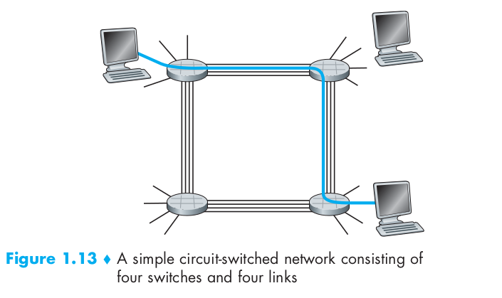

* 网络链路和交换机移动数据的两个基本方法：**电路交换**（circuit switching），**分组交换**（packet switching）。
* **电路交换**中，在端系统通信会话期间，预留了端系统间沿路径通信所需要的资源（缓存、链路传输率）。而在 **分组交换** 中是不预留的。
* 传统电话网络就是电路交换的一个例子，在发送方和接收方建立连接时，该路径上所有的交换机都将为该连接维护连接状态，该连接称为 **电路**（circuit）

#### 1. 电路交换网络中的复用

* 链路中的电路是通过 **频分复用**（Frequency-Division Multiplexing, FDM）和 **时分复用**（Time-Division Multiplexing, TDM） 实现的。

* FDM：连接期间链路为每条连接专用一个频段，频段宽度称为 **带宽**（band-width）。调频无线电台就是使用FDM来共享88MHz~108MHz。
* TDM：时间被划分为固定期间的 **帧**(frame)，每个帧又被划分为固定数量的 **时隙**(slot)。当网络跨越一条链路创建一个连接时，网络在每个帧中为该连接指定一个时隙专门由该连接单独使用。

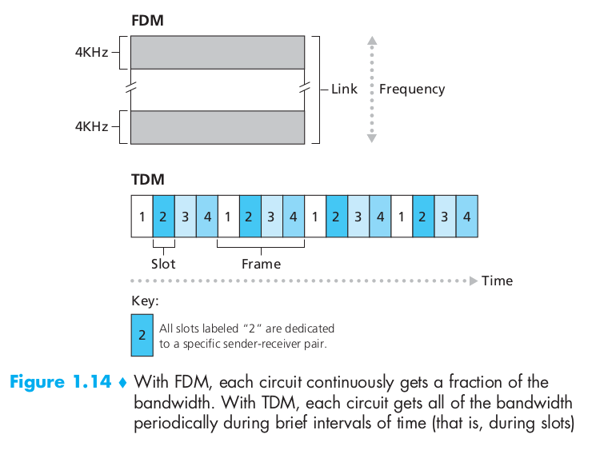

#### 2. 分组交换与电路交换的对比

分组交换性能能够优于电路交换的性能，发展趋势也是向着分组交换。

### 1.3.3 网络的网络

#### 1. 网络结构 1

假想用单一 **全球传输ISP**（提供商， provider）互联所有 **接入ISP**（客户，customer）

#### 2. 网络结构 2

由数十万接入ISP和多个全球传输ISP组成，多个全球传输ISP必须是互联的。

#### 3. 网络结构 3

第一层不仅有多个竞争ISP，在一个区域也可能有多个竞争ISP，比如中国，每个城市有接入ISP，他们与省级ISP连接，省级ISP又与国家级ISP连接，国家级ISP最终与第一层ISP连接。

## 1.4 分组交换网络中的时延、丢包和吞吐量

**吞吐量**：每秒钟能够传送的数据量

### 1.4.1 分组交换网中的时延概述

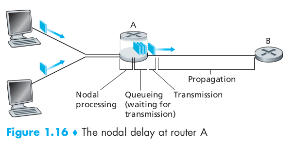

#### 1.处理时延 

检查分组首部和决定该分组导向何处所需要的时间是其一部分，也包括其他因素，比如检查比特级别的差错所需要的时间。

#### 2. 排队时延

一个特定的分组的排队时延长度将取决于先期到达的正在排队等待向链路传输的分组数量。

#### 3. 传输（发射）时延

L比特表示分组长度，R bps表示从路由器A到路由器B的链路传输速率。则传输时延是 L/R。

#### 4.传播时延

两台路由器之间的距离除以传播速率 (d/s)

#### 5.传输时延和传播时延比较

传输时延是路由器推出分组所需要的时间，是分组长度和链路传输速率的函数，与两台路由器距离无关。传播时延是一个比特从一台路由器传播到另一台路由器所需的时间，是两台路由器间距离的函数，与分组长度和链路传输速率无关。

### 1.4.2 排队时延和丢包

* 令 a 表示分组到达队列的平均速率（分组/秒）。R 是传输速率（bps）。每个分组由 L 比特组成。则 La/R 被称为 **流量强度**（traffic intensity）。流量强度不能大于1，否则排队时延趋于无限大。

* 随着流量强度接近于1，排队时延并不是真正趋向无穷大，相反，到达的分组将发现一个满的队列，由于没地方储存这个分组，路由器将丢弃（drop）该分组，该分组会丢失（lost）。

### 1.4.3 端到端时延

dend-end = N(dproc + dtrans + dprop)

### 1.4.4 计算机网络中的吞吐量

主机A到主机B跨越计算机网络传送一个大文件。

* 任何时间瞬间的 **瞬时吞吐量** 是主机B接收到文件的速率（bps计）

* 如果文件由F比特组成，主机B接收到所有F比特用去T秒，则文件传送的 **平均吞吐量** 是F/T bps。

* 对于简单的两链路网络，其吞吐量是min{Rc, Rs}，它是 **瓶颈链路**。

  

  对应图 b. 文件传输吞吐量是{R1, R2, ... , RN}。

* 吞吐量取决于数据流过的链路的传输速率还有干扰流量。

## 1.5 协议层次及其服务模型

### 1.5.1 分层的体系结构

#### 1. 协议分层

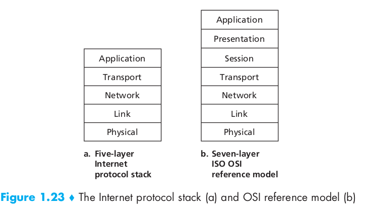

各层的所有协议被称为协议栈（protocol stack），因特网的协议栈由5各层次组成：物理层、链路层、网络层、运输层、应用层。

(1) 应用层

* 应用层是网络应用程序及它们的应用层协议存留的地方。协议比如有 **HTTP**（提供了Web文档的请求和传送）、**SMTP**（提供了电子邮件报文的传输）和 **FTP**（提供两个端系统之间的文件传送）。**DNS** 域名系统。

* 位于应用层的信息分组称为 **报文**。

(2) 运输层

* 因特网的运输层在应用程序端点之间传送应用层报文。
* 两种运输协议，**TCP** 和 **UDP** 。
* **TCP**：向应用程序提供面向连接的服务。包括应用层报文向目的地的确保传递和流量控制（发送方/接收方速率匹配）。TCP 也将长报文划分为短报文，并提供拥塞控制机制，网络拥塞时，源会抑制其传输速率。
* **UDP**：向应用程序提供无连接服务。这是一种不提供不必要服务的服务，没有可靠性，没有流量控制，也没有拥塞控制。
* 运输层的分组称为 **报文段**。

(3) 网络层

* 网络层负责将称为 **数据报**（datagram）的网络层分组从一台主机移动到另一台主机。源主机中的运输层协议（TCP UDP）向网络层递交运输层**报文段**和**目的地址**
* 包含 **网际协议IP**，定义了在数据报中的各个字段以及端系统和路由器如何作用于这些字段。
* 包含 **路由选择协议** 根据该路由将数据报从源传输到目的地。

(4) 链路层

* 网络层将数据报下传给链路层，链路层沿着路径将数报传递给下一个级节点，在下一个节点，链路层将数据报上传给网络层。

* 链路层分组称为 **帧**（frame）

(5) 物理层

物理层任务是将该帧中的一个个比特从一个节点移动到下一个节点。

#### OSI模型

7层：应用层、表示层、会话层、运输层、网络层、链路层、物理层。

### 1.5.2 封装

* 运输层收取到报文并附上附加信息 Ht 构成运输层报文段
* 网络层收取到报文段，增加源和目的端系统地址等网络层首部信息 Hn 构成网络层数据报
* 链路层收取到数据报，增加自己的链路层首部信息 Hl 构成链路层帧
* 一个分组分为 首部字段 和 **有效载荷字段**（来自上一层的分组）

### 1.6 面向攻击的网络

* **拒绝服务攻击**：DoS （Denial-of-Service Attack)

* **分布式DOS**（Distributed DoS, DDoS)

# 第二章：应用层

## 2.1 应用层协议原理

### 2.1.1 网络应用程序体系结构

* **客户-服务器体系结构**：有一个总打开的主机称为服务器，服务与来自许多称为客户的主机请求。
* **P2P体系结构**：对位于数据中心的专用服务器有最小或者没有依赖，应用程序在间断连接的主机对之间直接使用通信，其中主机对称为 **对等方**。

### 2.1.2 进程通信

#### 1. 客户和服务器进程

对每对通信进程，一个标识为 **客户**（client），另一个表示为 **服务器**（server）。发起会话的是客户，等待联系的是服务器。

#### 2. 进程与计算机网络之间的接口

* **套接字**：同一台主机中应用层和运输层之间的接口，也被称为应用程序和网络之间的应用程序编程接口（Application Programming Interface, API）。

#### 3. 进程寻址

* 主机由 **IP地址** 标识。
* 接收进程由 **端口号** 标识。

### 2.1.3 可供应用程序使用的运输服务

1. 可靠数据传输
2. 吞吐量
3. 定时
4. 安全性

### 2.1.4 因特网提供的运输服务

#### 1. TCP服务

* 面向连接的服务：应用层报文开始流动之前，TCP让客户和服务器互相交换运输层控制信息。
* 可靠的数据传送服务：应用程序一端将字节流传进套接字时，TCP能将相同的字节流交付给接收方。
* 拥塞控制机制：网络拥塞时，会抑制发送进程。
* TCP加强版 **安全套接字层**（Secure Sockets Layer, SSL），SSL不是第三种运输协议，而是对TCP的一种加强。

#### 2. UDP服务

无握手过程，提供不可靠数据传送服务，报文可能乱序到达，无拥塞机制。

#### 3. 因特网运输协议所不能提供的服务

吞吐量和定时没有被提供

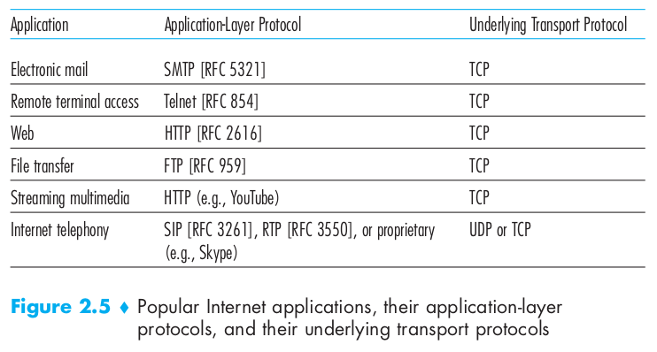

### 2.1.5 应用层协议

应用层协议定义了：

* 交换的报文类型，例如GET POST
* 报文类型的语法
* 字段的信息含义
* 何时以及如何发送报文

## 2.2 Web和HTTP

### 2.2.1 HTTP概况

* Web的应用层协议是 **超文本传输协议**(HyperText Transfer Protocol, HTTP）
* HTTP服务器不保存客户任何信息，所以HTTP是一个 **无状态协议**（stateless protocol）

### 2.2.2 非持续连接和持续连接

* **非持续连接（non-persisent connection）**：每次请求/响应是经过一个单独的TCP进行的。

* **持续连接（persistent connection）**：所有请求和响应经过同一TCP进行。
* **RTT**：（Round-Trip Time）往返时间

#### 1. 采用非持续连接的HTTP

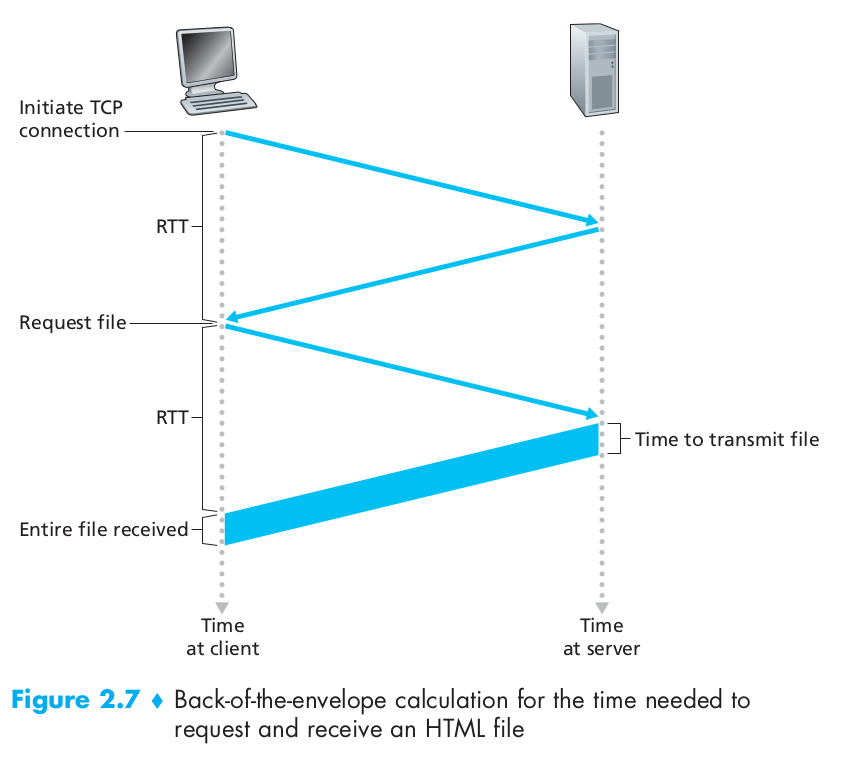

三次握手，前两部分占用一个RTT

总的响应时间是两个RTT加上服务器传输HTML文件的时间。

#### 2. 采用持续连接的HTTP

一个完整的web页面可用单个TCP连接进行传送

同一服务器的多个web页面可用单个TCP连接进行传送

### 2.2.3 HTTP报文格式

#### 1. HTTP请求报文

> GET /somedir/page.html HTTP/1.1
> Host: www.someschool.edu
>
> Connection: close
> User-agent: Mozilla/5.0
> Accept-language: fr

HTTP请求报文第一行叫作 **请求行**（request line）, 后继行叫作 **首部行**（header line）

* 请求行有三个字段：

  * 方法字段：GET、POST、HEAD、PUT、DELETE

  * URL字段

  * HTTP版本字段

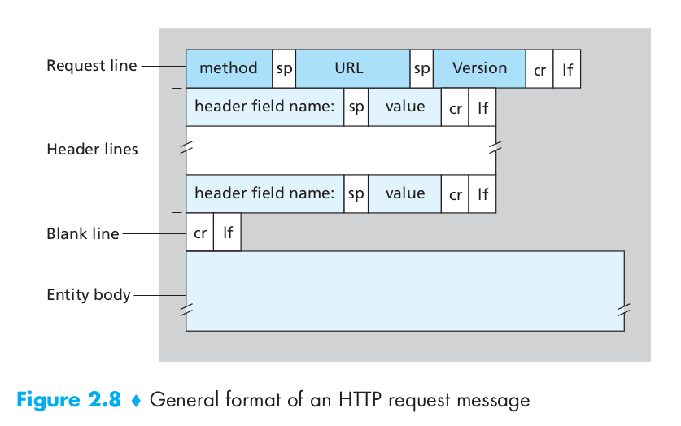

#### 2. HTTP响应报文

>HTTP/1.1 200 OK
>Connection: close
>
>Date: Tue, 09 Aug 2011 15:44:04 GMT
>Server: Apache/2.2.3 (CentOS)
>Last-Modified: Tue, 09 Aug 2011 15:11:03 GMT
>Content-Length: 6821
>Content-Type: text/html
>(data data data data data ...)

一个初始 **状态行**（status line），6个 **首部行**（header line），然后是 **实体体**（entity body）

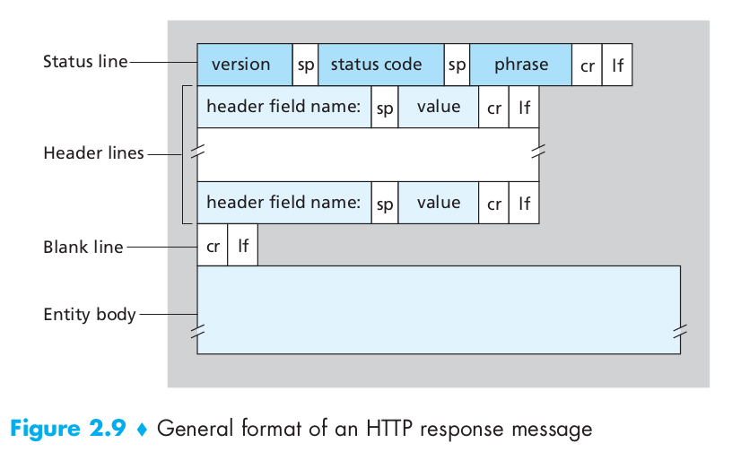

### 2.2.4 用户与服务器的交互：cookie

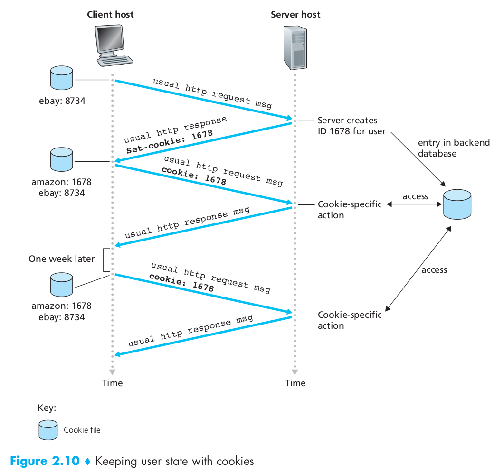

### 2.2.5 Web缓存

* **Web缓存器**（Web cache）也叫 **代理服务器**（proxy server）

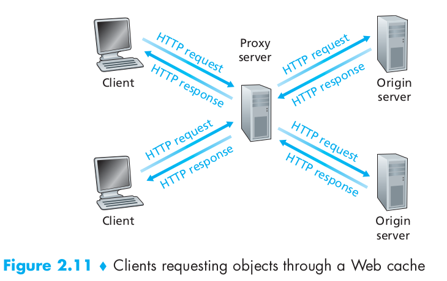

### 2.2.6 条件GET方法

* **条件GET**（conditional GET）：HTTP协议的一种机制，允许缓存器证实它的对象是最新的。

* 如果报文使用的是GET方法并且请求报文中包含一个"If-Modifed-Since:"首部行，则这个HTTP请求报文是条件GET请求报文。
* 由缓存服务器向目的服务器发送，如果请求的资源没有改变，目的服务器会回复 304 Not Modified 响应报文。

## 2.4 DNS：因特网的目录服务

* **主机名**（hostname）
* **IP地址**（IP Address）

### 2.4.1 DNS提供的服务

* **DNS**（Domain Name System）：

  * 是一个由分层的DNS服务器实现的分布式数据库。

  * 是一个使得主机能够查询分布式数据库的应用层协议。

  * DNS服务器通常是运行BIND（Berkeley Internet Name Domain）软件的UNIX机器。
  * 运行在UDP之上，使用53号端口。

* 提供的服务：

1. 主机名到IP地址的转换
2. **主机别名**（host aliasing）：复杂主机名的主机能拥有一个或多个别名原名叫做 **规范主机名**（canonical hostname)。
3. **邮件服务器别名**（mail server aliasing）：MX记录允许邮件服务器和Web服务器使用相同的主机名
4. **负载分配**（load distribution）：部署在分布式服务器的站点有多个IP，所以一个IP集合与一个规范主机名相联系。DNS服务器数据库中储存着这个集合，每次收到该主机名的DNS请求时，DNS服务器会用整个IP集合响应，但是每次都会循环这些IP的次序。 

### 2.4.2 DNS工作机理概述

1. 分布式、层次数据库

   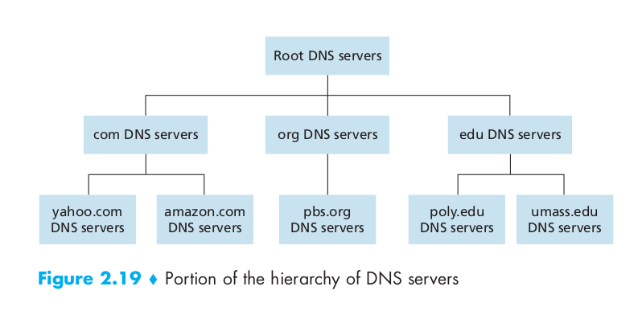

* **根DNS服务器**：提供顶级域服务器地址。
* **顶级域服务器**（Top-level Domain, TLD）：提供权威DNS服务器地址。
* **权威DNS服务器**：提供公共可访问主机的IP地址。

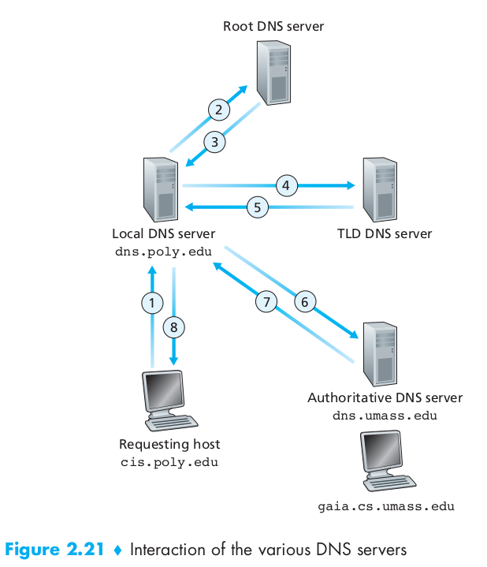

2. DNS缓存（DNS caching）

   DNS服务器接收到DNS回答能将映射缓存到本地存储器中。

### 2.4.3 DNS记录和报文

* DNS服务器存储了 **资源记录**（Resource Record，RR），提供了主机名到IP地址的映射。RR是一个4元组(Name, Value, Type, TTL)，TTL决定该缓存删除的时间。Name和Value由Type决定。
* 如果 Type = A， 则 Name是主机名，Value是对应的IP地址。
* 如果 Type = NS， 则Name是域，Value是权威DNS服务器主机名。
* 如果 Type = CNAME，则Value是个别名为Name的主机的规范主机名
* 如果 Type = MX，则Value是个别名为Name的邮件服务器的规范主机名 

* DNS报文

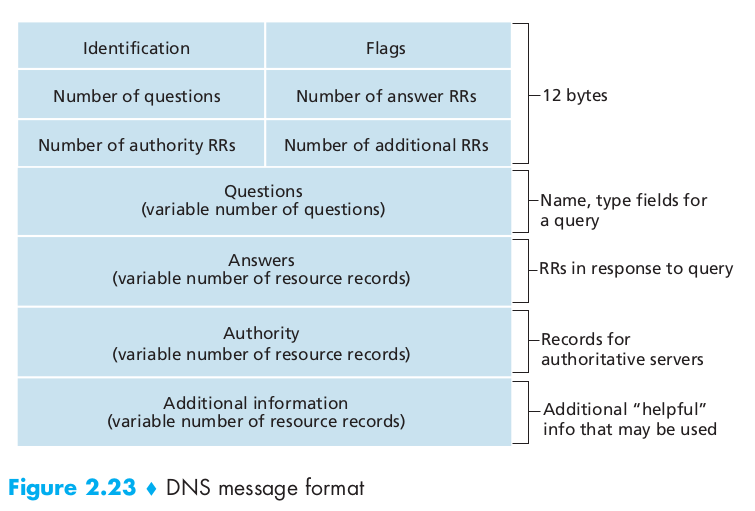

# Http协议
[参考](https://segmentfault.com/a/1190000015969377)
## Http 0.9
最早的一个版本，只支持GET
## Http 1.0
每个tcp连接只能发送一个请求，可以使用keep-alive选项解决
## Http 1.1
长连接：tcp默认不关闭，每个站点允许建立6个持久连接，默认开启keep-alive  
管道机制：在同一个TCP连接里，可以同时发送多个请求。但是服务器还是要按照请求的顺序进行响应，会造成“队头阻塞”。

