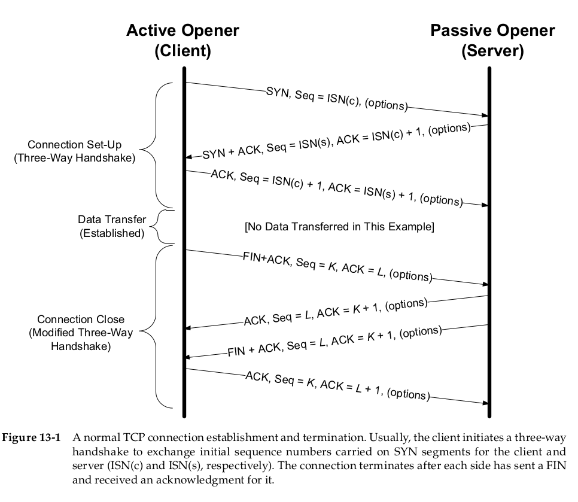
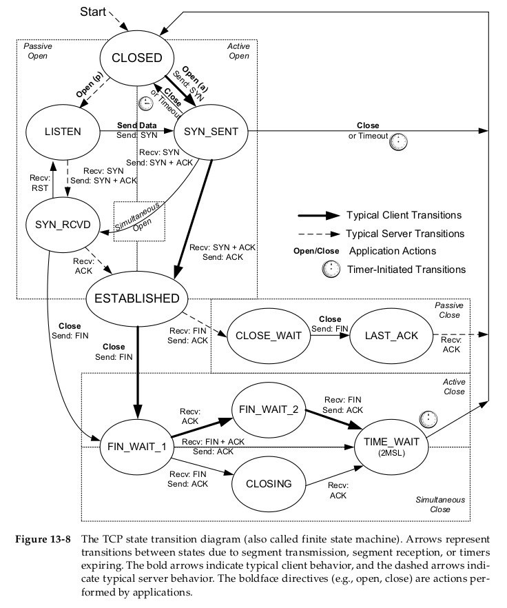

# TCP笔记

## TCP头部结构

基础的TCP头部长度以32位字为单位，共20Bytes
* 客户端端口和服务端端口(16bits * 2)
* 序列号(32bits) 
  TCP为每个字节赋予一个序列号，一个TCP头中的序列号标识着该报文段中数据的第一个字节。
* ACK号(32bits)
  最后被成功接收到的数据字节的序列号+1。
  tip:发送一个ACK与发送任何一个TCP报文段的开销是一样的，因为ACK号字段和ACK位字段都是头部的一部分。
* 头部长度(4bits)
  因为TCP头部有可选项，所以长度是不确定的，需要该字段注明头部长度。以32位字为单位，所以四位表示范围0～60Bytes，也就是TCP头部被限制在60Bytes，而基础不含选项的头部为20Bytes。
* 保留字段(4bits)
* 标志位(8bits)
  * CWR 拥塞窗口减 (发送方降低它的发送速率)
  * ECE ECN回显 (发送方接收到了一个个更早的拥塞通告)
  * URG 紧急 (紧急指针字段有效)，此标志位很少被使用。
  * ACK 确认 (确认号字段有效)，TCP连接建立一般都是启用状态。
  * PSH 推送 (告知接收方应该尽快将数据推送给应用程序)
  * RST 重置连接 (遇到错误，连接取消)
  * SYN 初始化连接的同步序列号。
  * FIN 发送方告知接收方已经结束发送数据，要关闭连接。
* 窗口大小(16bits)
  告知想接受的数据大小，以Bytes为单位，16bits限制了数据大小在65535Bytes。
* 校验和(16bits)
  发送方计算和保存，接收方验证
* 紧急指针(16bits)
  让发送方给另一端提供特殊标志数据
* 选项字段(最大40Bytes)
## TCP连接的建立和关闭

* TCP连接的建立（三次握手）
  1. 主动开启者（通常为客户端）向被动开启者发送一个SYN，并且附上初始序列号ISN(c)。
  2. 被动开启者收到后也发送一个SYN，并且附上ACK，ACK号为ISN(c)+1，还附上了被动开启者的初始序列号ISN(s)。
  3. 主动开启者收到SYN后，返回一个ACK，序列号为ISN(c)+1，ACK号为ISN(s) + 1;
   
   （以上的报文段中都可带选项）
   **注意**：初始序列号可视为一个32位计数器，每4微秒加1，防止与其他连接序列号重叠。
   **为什么需要三次握手？**

* TCP连接的关闭（四次挥手）
  1. 主动关闭者发送一个FIN报文段，其中还有一个序列号K，一个ACK（ACK号为L）用来确认最近一次收到的数据。
  2. 被动关闭者收到FIN段后，回复一个ACK，序列号为L，ACK号为K+1
  3. 被动关闭者接着发送一个FIN段，序列号为L，ACK号为K+1
  4. 主动关闭者收到后回复一个ACK，序列号为K，ACK号为L+1

  （以上的报文段中都可带选项）   
  **为什么需要四次挥手？**
## TCP状态转换

