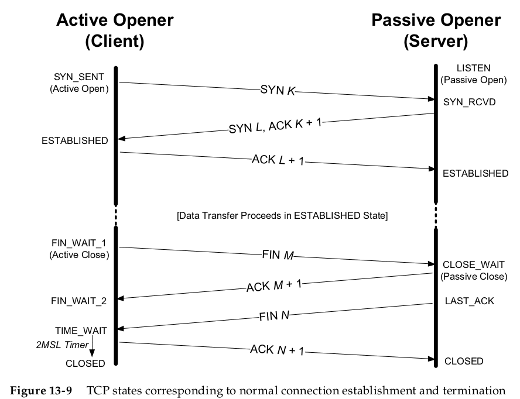
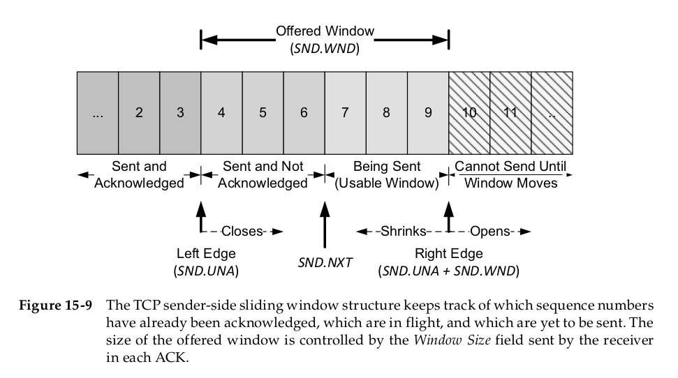
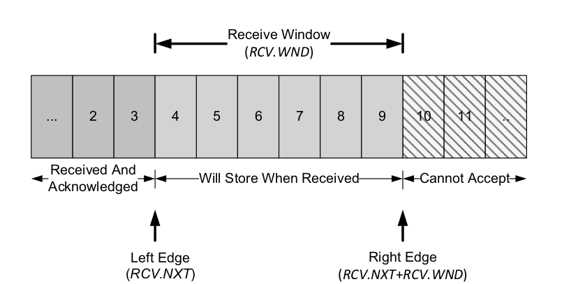

# 传输层

## TCP头部结构

基础的TCP头部长度以32位字为单位，共20Bytes
* 客户端端口和服务端端口(16bits * 2)
* 序列号(32bits) 
  TCP为每个字节赋予一个序列号，一个TCP头中的序列号标识着该报文段中数据的第一个字节。
* ACK号(32bits)
  最后被成功接收到的数据字节的序列号+1。
  tip:发送一个ACK与发送任何一个TCP报文段的开销是一样的，因为ACK号字段和ACK位字段都是头部的一部分。
* 头部长度(4bits)
  因为TCP头部有可选项，所以长度是不确定的，需要该字段注明头部长度。以32位字为单位，所以四位表示范围0～60Bytes，也就是TCP头部被限制在60Bytes，而基础不含选项的头部为20Bytes。
* 保留字段(4bits)
* 标志位(8bits)
  * CWR 拥塞窗口减 (发送方降低它的发送速率)
  * ECE ECN回显 (发送方接收到了一个个更早的拥塞通告)
  * URG 紧急 (紧急指针字段有效)，此标志位很少被使用。
  * ACK 确认 (确认号字段有效)，TCP连接建立一般都是启用状态。
  * PSH 推送 (告知接收方应该尽快将数据推送给应用程序)
  * RST 重置连接 (遇到错误，连接取消)
  * SYN 初始化连接的同步序列号。
  * FIN 发送方告知接收方已经结束发送数据，要关闭连接。
* 窗口大小(16bits)
  告知想接受的数据大小，以Bytes为单位，16bits限制了数据大小在65535Bytes。
* 校验和(16bits)
  发送方计算和保存，接收方验证
* 紧急指针(16bits)
  让发送方给另一端提供特殊标志数据
* 选项字段(最大40Bytes)
## TCP连接的建立和关闭

* TCP连接的建立（三次握手）
  1. 主动开启者（通常为客户端）向被动开启者发送一个SYN，并且附上初始序列号ISN(c)。
  2. 被动开启者收到后也发送一个SYN，并且附上ACK，ACK号为ISN(c)+1，还附上了被动开启者的初始序列号ISN(s)。
  3. 主动开启者收到SYN后，返回一个ACK，序列号为ISN(c)+1，ACK号为ISN(s) + 1;
   
   （以上的报文段中都可带选项）
   **注意**：初始序列号可视为一个32位计数器，每4微秒加1，防止与其他连接序列号重叠。  
   **为什么需要三次握手？**
   倘若只有两次握手（客服端发送SYN，服务端回一个ACK，就建立一个TCP连接），那么当SYN在网络中滞留很久后，客户端重传了这个SYN，最后服务端可能会收到两个SYN，就会错误地建立两个TCP连接。所以必须要第三次握手，让客户端确认一下，再建立起连接。

* TCP连接的关闭（四次挥手）
  1. 主动关闭者发送一个FIN报文段，其中还有一个序列号K，一个ACK（ACK号为L）用来确认最近一次收到的数据。
  2. 被动关闭者收到FIN段后，回复一个ACK，序列号为L，ACK号为K+1
  3. 被动关闭者接着发送一个FIN段，序列号为L，ACK号为K+1
  4. 主动关闭者收到后回复一个ACK，序列号为K，ACK号为L+1

  （以上的报文段中都可带选项）   
  **为什么需要四次挥手？**
  前两次挥手后，也就是被动关闭端确认了主动关闭端的FIN后，会进入CLOSE_WAIT状态，在这个状态下，是为了等待发送完还没有发完的数据，发完后才会发送一个自己的FIN（第三次握手），告知主动关闭端我的数据已经发完了，马上也要关闭了，被动关闭端当然需要确认主动关闭端已经知道自己数据发送完了（避免FIN丢失），所以会等主动关闭端的ACK（第四次握手）。

## TCP状态转换
  

建立连接：
* TCP初始化时状态为`CLOSED`, 如果是主动打开方会快速发送一个SYN转换为`SYN_SENT`状态，如果是被动打开方，会快速转换为`LISTEN`状态。
* `LISTEN`状态收到SYN后，返回一个SYN+ACK，进入`SYN_RCVD`状态。
* `SYN_SENT`状态收到SYN_ACK，发送一个ACK，进入`ESTABLISHED`状态。
* `SYN_RCVD`状态收到ACK，进入`ESTABLISHED`状态。

同时建立连接：
* 两方同时发送SYN，由`CLOSED`状态进入`SYN_SENT`状态。
* 两方接收到SYN后发送SYN+ACK，由`SYN_SENT`状态进入`SYN_RCVD`状态。
* 两方接收到SYN+ACK，发送ACK，`SYN_RCVD`进入`ESTABLISHED`状态。

关闭连接：

* 主动关闭方和被动关闭方都从`ESTABLISHED`状态开始。
* 主动关闭方发送一个FIN，`ESTABLISHED`->`FIN_WAIT_1`
* 被动关闭方收到FIN，回复一个此FIN的ACK，`ESTABLISHED`->`CLOSE_WAIT`
* 主动关闭方收到ACK，`FIN_WAIT_1`->`FIN_WAIT_2`
* 被动关闭方发送一个FIN，`CLOSE_WAIT`->`LAST_ACK`
* 主动关闭方收到FIN，回复一个此FIN的ACK，`FIN_WAIT_2`->`TIME_WAIT`
* 被动关闭方收到ACK，`LAST_ACK`->`CLOSED`
  
同时关闭：
* 主动关闭方和被动关闭方都从`ESTABLISHED`状态开始。
* 双方都发送一个FIN，`ESTABLISHED`->`FIN_WAIT_1`
* 都收到FIN，回复此FIN的ACK，`FIN_WAIT_1`->`CLOSING`
  都收到ACK，`CLOSING`->'`TIME_WAIT`

**TIME_WAIT的作用**
1. 在TCP主动关闭方发送最后一个ACK时会进入`TIME_WAIT`而不是直接进入`CLOSED`，`TIME_WAIT`状态会保持2msl(2 maximun segment lifetime)的时长，一个msl是IP数据报在被接收前能够在网络中存活的最大时间。之所以要2msl的时间是考虑到：最后一个ACK丢失，被动方重传FIN，希望能收到ACK，这个过程完成的时间在极端情况下就是2msl
**注意**：`TIME_WAIT`只是尽可能保证TCP全双工连接的终止，因为被动方重传的FIN也可能丢失，导致2msl过了被动方也没能收到此FIN的ACK
2. TCP的一条连接由一个四元组(src_ip, src port, dst_ip, dst_port)标识，当处于`TIME_WAIT`时，此条连接会被定义为不可使用，这样就避免了一条连接关闭后能立即生成同一条连接，接收到上一次连接的分组。

**避免TIME_WAIT**
`SO_REUSEADDR`这个套接字选项允许分配处于`TIME_WAIT`的端口来建立TCP连接。这一点违背了TCP的最初规范，但是只要能保证不会收到上一条连接分组的干扰，就可以使用。

## 超时重传
TCP超时重传的基础就是需要根据RTT（Round-Trip Time）分组往返时间设置RTO（Retransmission Timeout）超时重传时间。  
上述过程有以下方法：
* 经典方法
  SRTT = a(SRTT) + (1-a)RTT，其中a取0.8-0.9，SRTT为平滑RTT估计值，RTT为新测的一个RTT样本。得到新的SRTT后，RTO = min(ubound, max(lbound, (SRTT)b))，其中ubound是RTO的上边界，lbound为RTO下边界，b为时延离散因子，通常为1.3-2.0。
  此方法在RTT波动较大的网络中，效果很差。
* 标准方法
  基于平滑RTT和平滑偏差计算
  （平滑RTT）srtt = (1-g)srtt + gM   
  （平滑偏差）rttvar = (1-h)rttvar + h(|M-srttt|)
  RTO = srtt + 4rttvar

## 快速重传
根据收到冗余的ACK来判断是否发生丢包，通常冗余ACK的数量有个阈值dupthresh（常量3），到这个值时，大概率产生丢包，发生重传。

**一个重传尝试到一定次数后会判断连接故障，关闭连接。**

## 重传二义性和karn算法
* 当重传了一个数据包后，收到一个确认，该确认可能是第一次传输的确认也可能是重传的确认。
* 很明显根据此确认计算RTT可能不是准确的，所以karn算法第一部分规定，接收重传的确认时，不更新RTT估计值。
* 每重传一次，计算RTO的退避系数加倍，这是karn算法的第二部分。

# 数据流与窗口管理

## 延时确认
大多数情况下，TCP不会为每个受到的数据包返回一个ACK，而是累计收到多个后，返回一次ACK，但是为了避免引发重传，延时理论值最高为500ms，实际中最大取的是200ms。

## Nagle算法
为了减少网络中微型包的数量，引入了nagle算法。
* 一个TCP连接中只允许有一个小于MSS的报文段在传输，在该报文段的ACK到达之后，TCP会收集小数据并整合为在一个报文段中再发送。

### 延时ACK和Nagle算法
若两者结合使用，结果可能会很不理想。比如说客户端使用延时ACK，服务端使用nagle算法，当服务端发送了一个小包后，会一直等这个包的ACK，而客户端接收到这个小包后进入延时ACK的计时器，希望有新的数据包捎带此ACK回复给服务端，这样两者会互相等待对方，造成暂时性死锁。
**禁用nagle**：设置TCP_NODELAY选项。

## 流量控制
发送端根据接收端发送的报文段中的窗口大小字段，来动态调整发送数据的大小。基于窗口实现。
### 滑动窗口

1. 关闭：窗口左边界右移。当已发送的数据收到ACK时，窗口会减小。
2. 打开：窗口右边界右移。当已确认数据得到处理，窗口会变大。
3. 收缩：窗口右边界左移。不支持这种做法。

### 接收窗口
  
到达的序列号小于RCV.NXT或大于RCV.NXT+RCN.WND则丢弃。只有序列号等于RCV.NXT时，窗口才会向右移动，但是设置了SACK选项后，也可以确认窗口内的其他报文段(乱序包),直到收到序号等于RCV.NXT的包，窗口才会向右滑动。

### 零窗口和持续计时器
当接收端的窗口值变为0时，会通知给发送端，直到应用程序处理数据，窗口重新获得可用空间时，会给发送端发一个窗口更新(一个纯ACK)，不保证传输可靠，所以如果丢失，双方都会等待，发送方等待窗口更新，接收方等待接收数据。为了避免此死锁发生，TCP引入了 **持续计时器**。
* 当发送端收到零窗口通告时，会开启持续计数器，间歇性的发送窗口探测，强制要求接收端回复一个ACK(包含了窗口大小)查询接收端的窗口是否增长。一般在第一个RTO后发送第一个窗口探测，随后采用指数规避发送窗口探测。

### 糊涂窗口综合征（silly window syndrome）
发生该问题的时候，TCP交换的不是全长包，而是一些小包，小包传输代价相对大，传输效率很低。  
出现原因：
* 接收端通告窗口太小
* 发送端发送的数据较小

应对：
* 接收端：窗口增至可以放下一个全长报文段，或者接收端缓存的一半（两者中较小者）的时候才能开始发送新窗口通告。
* 发送端：1.可以发送一个全长报文段 2.可以发送数据段长度 >= 接收端通告过的最大窗口值的一半的报文段 3.当禁用了Nagle算法或者所有发出的数据都已经被对端ACK确认的话，那么TCP可以发送小数据包

# 拥塞控制
拥塞控制和流量控制很像，但是后者是为了控制发送端的发送速率，避免接收端收到的数据溢出，而拥塞控制是为了降低网络中的拥塞程度。

发送端维护着一个拥塞窗口（congestion window， cwnd），发送端实际上可发送窗口大小为 W = min(cwnd， awnd), 其中awnd为接收端通告窗口。  

TCP拥塞控制主要有以下算法：
* 慢启动
* 拥塞避免
* 快重传
* 快恢复

## 慢启动
* 在一个TCP连接刚建立时，或者重传计时器检测到网络中产生丢包后，会执行慢启动。因为在这两种情况下不知道网络传输能力（cwnd的值），所以需要先得到一个cwnd的初值。而得到cwnd初值的方法就是以越来越快的速度不断发送数据，直到丢包为止。
* 但是考虑到如果一开始就以一个很大的速率发送，肯定会影响到其他连接的传输性能，所以采用慢启动的方式。  

慢启动的过程：  
