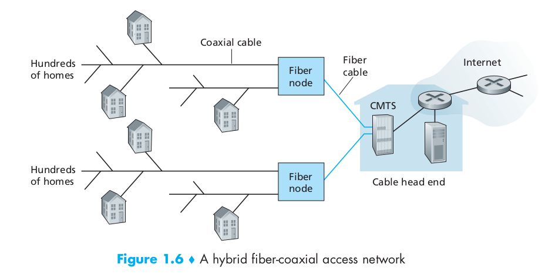
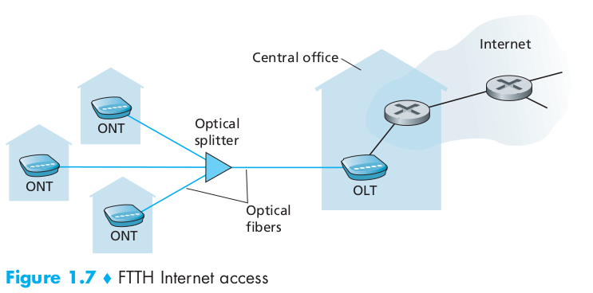
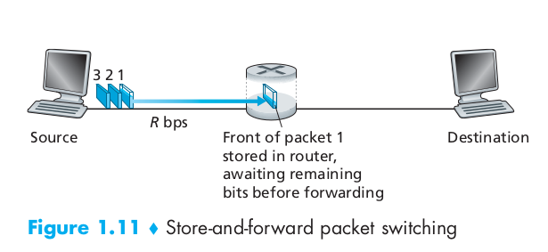

Table of Contents
=================

 * [第一章：计算机网络和因特网](#第一章计算机网络和因特网)
         * [1.1 什么是因特网](#11-什么是因特网)
            * [1.1.1 具体构成描述](#111-具体构成描述)
            * [1.1.2 服务描述](#112-服务描述)
            * [1.1.3 什么是协议](#113-什么是协议)
         * [1.2 网络边缘](#12-网络边缘)
            * [1.2.1 接入网](#121-接入网)
               * [1.家庭接入](#1家庭接入)
               * [2. 企业（和家庭）接入：以太网和WIFI](#2-企业和家庭接入以太网和wifi)
               * [3. 广域无线接入：3g和LTE](#3-广域无线接入3g和lte)
            * [1.2.2 物理媒体](#122-物理媒体)
         * [1.3 网络核心](#13-网络核心)
            * [1.3.1 分组交换](#131-分组交换)
               * [1. 存储转发传输](#1-存储转发传输)
               * [2. 排队时延和分组丢失](#2-排队时延和分组丢失)
               * [3. 转发表和路由选择协议](#3-转发表和路由选择协议)
            * [1.3.2 电路交换](#132-电路交换)
               * [1. 电路交换网络中的复用](#1-电路交换网络中的复用)
               * [2. 分组交换与电路交换的对比](#2-分组交换与电路交换的对比)
            * [1.3.3 网络的网络](#133-网络的网络)
               * [1. 网络结构 1](#1-网络结构-1)
               * [2. 网络结构 2](#2-网络结构-2)
               * [3. 网络结构 3](#3-网络结构-3)
         * [1.4 分组交换网络中的时延、丢包和吞吐量](#14-分组交换网络中的时延丢包和吞吐量)

# 第一章：计算机网络和因特网

### 1.1 什么是因特网

#### 1.1.1 具体构成描述

* **端系统** 通过 **通信链路** 和 **分组交换机** 连接到一起。
* 链路的 **传输速率** 以比特/秒（bit/s，或bps）度量。
* 当一台端系统向另一端系统发送数据时，发送端系统将数据分段，并为每段加上首部字节。由此形成的信息包称为 **分组**。
* 分组交换机两种最著名的类型是
  1. 路由器
  2. 链路层交换机
* **因特网服务提供商**：Internet Service Provider, ISP
* **传输控制协议**：Transmission Control Protocol,TCP
* **网际协议**：Internet Protocol， IP， 定义了在路由器和端系统之间发送和接收的分组格式

#### 1.1.2 服务描述

#### 1.1.3 什么是协议

### 1.2 网络边缘

#### 1.2.1 接入网

##### 1.家庭接入

* **DSL**：Digital Subscriber Line, 本地电话公司是ISP

  DSL调制解调器与位于电话公司的本地中心局（CO）中的数字用户线接入复用器（DSLAM）交换数据。家庭的DSL调制解调器得到数字数据后将其转换为高频音，以通过电话线传输给本地中心局；模拟信号在DSLAM处转换回数字形式。

  

* 电缆：cable Internet access, 有线电视公司是ISP

  电缆因特网接入需要 **电缆调制解调器** (cable modem)，在电缆头端，**电缆调制解调器** （CMTS）与DSLAM具有相似功能，即将下行家庭中的电缆调制解调器发送的模拟信号转换回数字形式。

* 光纤到户：Fiber To The Home, FTTH，从本地中心局直接到每户设置一根光纤，实际一根光纤由许多家庭共享。分配方式有 **主动光纤网络**（Active Optical Network, AON) 和 **被动光纤网络**（Passive Optical Network, PON）。

  PON：每个家庭具有一个 **光纤网络端接器**（Optical Network Terminator, ONT），连接到附近的分配器（splitter），中心局中的 **光纤线路端接器** 提供光信号和电信号之间的转换。

  

##### 2. 企业（和家庭）接入：以太网和WIFI

##### 3. 广域无线接入：3g和LTE

#### 1.2.2 物理媒体

* **导引型媒体**（guided media）
  1. 双绞铜线
  2. 同轴电缆
  3. 光纤

* **非导引型媒体**（unguided media）
  1. 陆地无线电信道
  2. 卫星无线电信道

### 1.3 网络核心

#### 1.3.1 分组交换

* 源端系统向目的端系统发送报文，会将长报文划分为较小的数据块，称之为 **分组**

* 在源和目的地之间，每个分组都通过 **通信链路** 和 **分组交换机** （主要有两类：**路由器**和**链路层交换机**）传送。
* 分组以等于该链路 **最大** 传输速率的速度在通信链路上传输

##### 1. 存储转发传输

在交换机能够开始向输出链路传输该分组的第一个比特之前，必须接收到整个分组

##### 2. 排队时延和分组丢失

* 对于每条相连的链路，该分组交换机有一个 **输出缓存**（output buffer，也称为 **输出队列**（output queue））。如果到达的分组传输到某条链路，但是该链路正在传输其他分组，则该分组必须在输出缓存中等待。因此除了 **存储转发时延** 以外，分组还要承受输出缓存的 **排队时延**。
* 如果一个分组到达时，输出缓存已满，则该分组或已经排队的分组之一将被丢弃，此为 **丢包。**

##### 3. 转发表和路由选择协议

* 每台路由器具有一个 **转发表** ，用于将目的地址（或目的地址的一部分）映射成为输出链路。
* **路由选择协议**（routing protocol）用于自动设置转发表。

#### 1.3.2 电路交换

* 网络链路和交换机移动数据的两个基本方法：**电路交换**（circuit switching），**分组交换**（packet switching）。
* **电路交换**中，在端系统通信会话期间，预留了端系统间沿路径通信所需要的资源（缓存、链路传输率）。而在 **分组交换** 中是不预留的。
* 传统电话网络就是电路交换的一个例子，在发送方和接收方建立连接时，该路径上所有的交换机都将为该连接维护连接状态，该连接称为 **电路**（circuit）

##### 1. 电路交换网络中的复用

* 链路中的电路是通过 **频分复用**（Frequency-Division Multiplexing, FDM）和 **时分复用**（Time-Division Multiplexing, TDM） 实现的。

* FDM：连接期间链路为每条连接专用一个频段，频段宽度称为 **带宽**（band-width）。调频无线电台就是使用FDM来共享88MHz~108MHz。
* TDM：时间被划分为固定期间的 **帧**(frame)，每个帧又被划分为固定数量的 **时隙**(slot)。当网络跨越一条链路创建一个连接时，网络在每个帧中为该连接指定一个时隙专门由该连接单独使用。

##### 2. 分组交换与电路交换的对比

分组交换性能能够优于电路交换的性能，发展趋势也是向着分组交换。

#### 1.3.3 网络的网络

##### 1. 网络结构 1

假想用单一 **全球传输ISP**（提供商， provider）互联所有 **接入ISP**（客户，customer）

##### 2. 网络结构 2

由数十万接入ISP和多个全球传输ISP组成，多个全球传输ISP必须是互联的。

##### 3. 网络结构 3

第一层不仅有多个竞争ISP，在一个区域也可能有多个竞争ISP，比如中国，每个城市有接入ISP，他们与省级ISP连接，省级ISP又与国家级ISP连接，国家级ISP最终与第一层ISP连接。

### 1.4 分组交换网络中的时延、丢包和吞吐量

